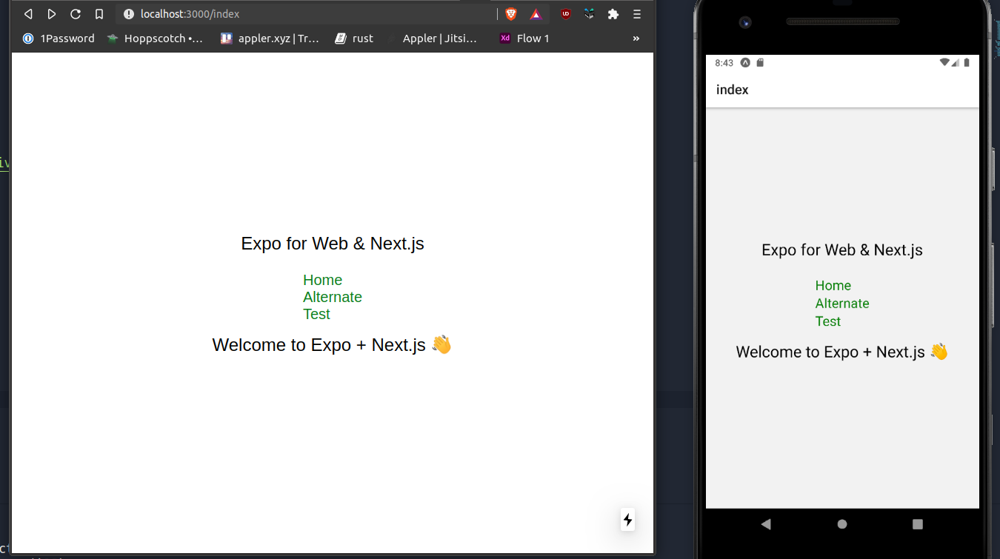

# NextExpoUnirepoNavi

  

  

  

  

---

### Based on Expo Examples
- Max credits go to https://github.com/nandorojo/expo-next-react-navigation & https://github.com/expo/examples/tree/master/with-nextjs 
- created a starter repo out of theior work

### A mobile starter template with :: 
- `react-native` with `expo`
- `expo-web` with `next` via `next-adapter`
- `react-navigation`
- `nextjs` based structure
- TODO: capability to have `api` code 

  <!-- Web -->
  

Using Next.js with Expo will enable you to [server side render](https://nextjs.org/features/server-side-rendering) the web part of your Expo app. This demo shows you how to setup your universal application to use use advanced universal modules from the Expo SDK like Camera, Gestures, Permissions, etc... with the Next.js tool-chain!

> 🚨 SSR is an experimental feature with Expo so modules might not be fully optimized for Next.js. If you find bugs please report them on the [Expo repo](https://github.com/expo/expo/issues) or [expo-cli repo](https://github.com/expo/expo-cli/issues) with the `[nextjs]` tag in the title.
>  Also, Next.Js empowers routing, which results in changing of URL paths when running in web browser 

> Taking some help from [here](https://github.com/vercel/next.js/tree/master/examples/with-react-native-web)

### ⚽️ Running in the browser

For the most updated guide you should refer to the Expo docs: [Using Next.js](https://docs.expo.io/versions/latest/guides/using-nextjs/). Here are the [latest docs on master](https://github.com/expo/expo/blob/master/docs/pages/guides/using-nextjs.md).

In this approach you would be using SSR for web in your universal project. This is the recommended path because it gives you full access to the features of Expo and Next.js.

- Bootstrap your project with Expo
  - Install the CLI: `npm i -g expo-cli`
  - Create a project: `expo init --template blank`
  - `cd` into the project
- Install the adapter:
  - **yarn:** `yarn add @expo/next-adapter`
  - npm: `npm i --save @expo/next-adapter`
- Add Next.js support: `yarn next-expo`
  - Always commit your changes first!
  - You can optionally choose which customizations you want to do with `--customize or -c`
  - Force reload changes with `--force or -f`
- Start the project with `yarn next dev`
  - Go to `http://localhost:3000/` to see your project!

### 🏁 New Commands

- **Starting web**
  - 🚫 `expo start:web`
  - ✅ `yarn next dev`

- **Building web**
  - 🚫 `expo build:web`
  - ✅ `yarn next build`

### 👀 More Info

- [Next Adapter repo](https://github.com/expo/expo-cli/tree/master/packages/next-adapter)
